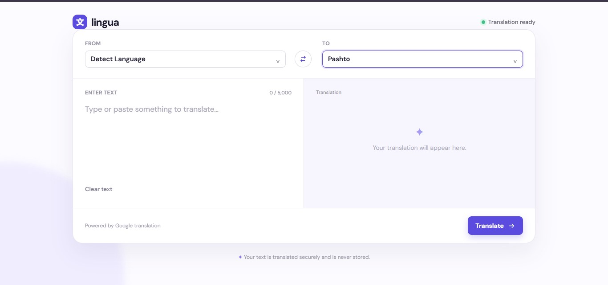
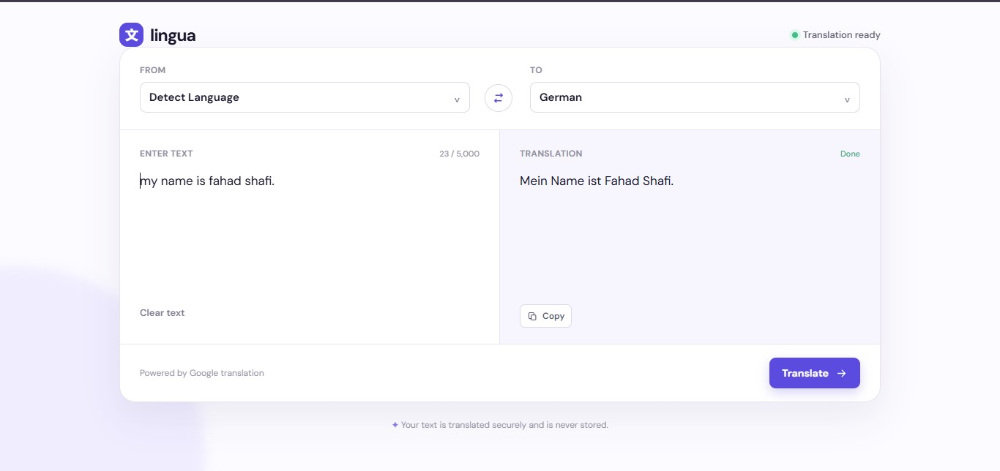

# Language Translation Tool

A simple web-based language translation tool built with Python and Flask. Users can enter text, choose source and target languages, and receive a translation using Google Translate.

## Features

- Translate text between multiple languages
- Detect the source language automatically
- Supports English, Urdu, Arabic, Pashto, Spanish, French, German, Hindi, Chinese, Japanese, and more
- Right-to-left display for Urdu and Arabic translations
- Copy the translated result with one click
- Clear text and swap source/target languages
- Clean, responsive user interface

## Technologies Used

- Python
- Flask
- Deep Translator (Google Translate)
- HTML, CSS, and JavaScript

## Project Structure

```text
language-translation-tool/
├── app.py                 # Flask application and translation logic
├── requirements.txt       # Python packages required by the project
├── README.md              # Project documentation
├── templates/
│   └── index.html         # Website page
└── static/
    ├── style.css          # Website styling
    └── app.js             # Copy, clear, and swap button actions
```

## Installation and Run

1. Open a terminal in the project folder:

```powershell
cd "E:\New\language translation tool"
```

2. Install the required packages:

```powershell
pip install -r requirements.txt
```

3. Start the Flask application:

```powershell
python app.py
```

4. Open this address in your browser:

```text
http://127.0.0.1:5000
```

## How to Use

1. Select the source language, or choose **Detect Language**.
2. Select the language you want to translate into.
3. Enter text in the left text box.
4. Click **Translate**.
5. Copy the translated text if needed.

## Screenshots



## GitHub
bash
```
https://github.com/ahmedshafifahad123/CodeAlpha_translation_tool.git
```

Create a new GitHub repository, then upload this project folder to it. Your repository should include:

- `app.py`
- `requirements.txt`
- `templates` folder
- `static` folder
- `README.md`

Example repository description:

> A Flask-based language translation web application using Google Translate.

## Notes

- An internet connection is required because translation is performed through Google Translate.
- This project is for educational use.
